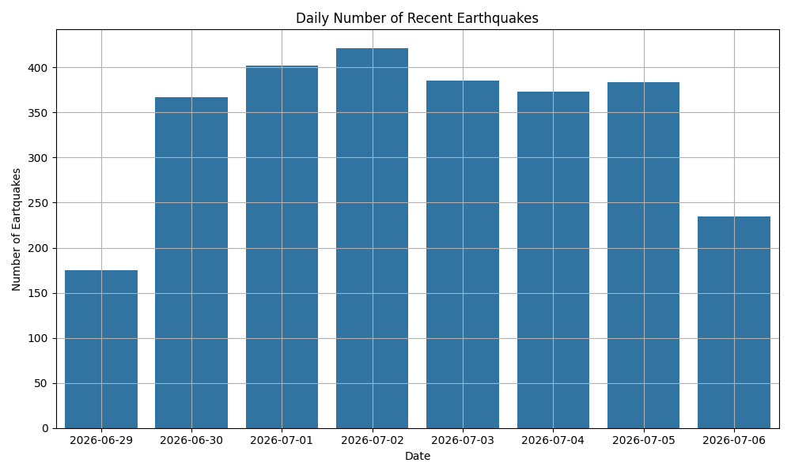
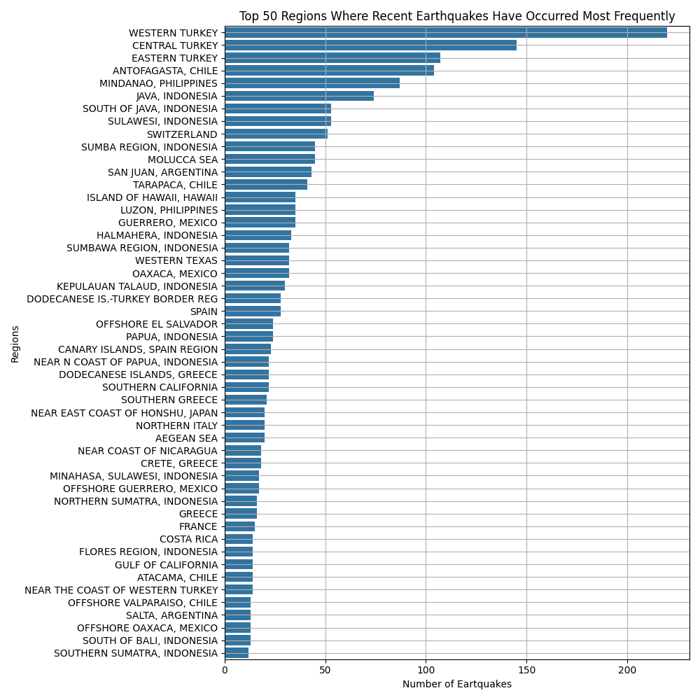
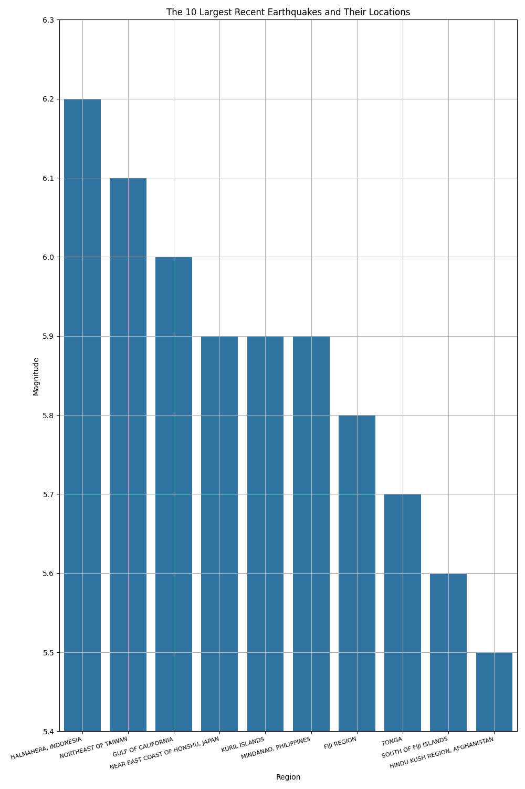
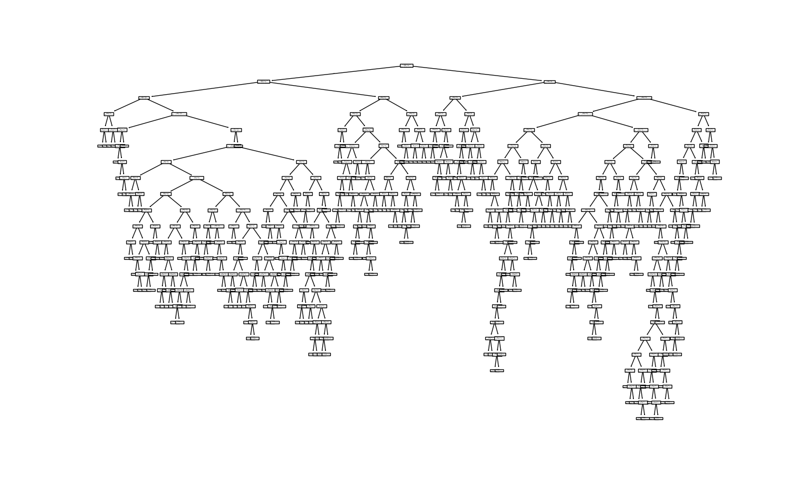
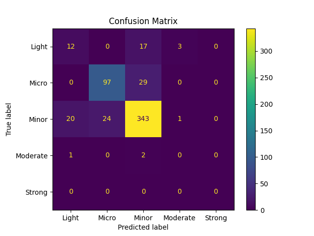

# Real-Time Earthquake Data Analysis and Magnitude Classification

## Abstract

This project implements an end-to-end data pipeline for the acquisition, preprocessing, exploratory analysis, geospatial visualization, and supervised classification of near real-time seismic event data. Raw observations are scraped from the European-Mediterranean Seismological Centre (EMSC), transformed into a structured tabular format, and used to train a decision tree classifier that predicts a discretized magnitude category (`Micro`, `Minor`, `Light`, `Moderate`, `Strong`) from spatial and depth-related features. The pipeline is organized into three modular stages — data ingestion, exploratory data analysis (EDA), and machine learning — each implemented as an independent Python module.

## Table of Contents

1. [Project Architecture](#project-architecture)
2. [Data Acquisition](#1-data-acquisition)
3. [Data Cleaning and Feature Engineering](#2-data-cleaning-and-feature-engineering)
4. [Exploratory Data Analysis](#3-exploratory-data-analysis)
5. [Geospatial Visualization](#4-geospatial-visualization)
6. [Machine Learning Pipeline](#5-machine-learning-pipeline)
7. [Model Evaluation](#6-model-evaluation)
8. [Repository Structure](#repository-structure)
9. [Technology Stack](#technology-stack)
10. [Installation and Usage](#installation-and-usage)
11. [Limitations and Future Work](#limitations-and-future-work)
12. [AI Assistance Disclosure](#ai-assistance-disclosure)

---

## Project Architecture

The system follows a modular, three-stage pipeline pattern, where each stage consumes the output artifact of the previous one:

```
eartquake_df_load.py   →   earthquake_analysis.py   →   ml_earthquake.py
   (Data Ingestion)          (EDA & Preprocessing)         (ML / Classification)
        │                            │                            │
        ▼                            ▼                            ▼
   dataset.csv               dataset_edited.csv          confusion_matrix_plot.png
                              images/*.png                decision_tree_plot.png
```

This separation of concerns follows the classical **ETL (Extract–Transform–Load)** paradigm adapted for a data science workflow: extraction via web scraping, transformation via cleaning/feature engineering, and loading into downstream statistical/ML models.

---

## 1. Data Acquisition

Implemented in `eartquake_df_load.py`.

Data is collected from the [EMSC](https://www.emsc-csem.org/) live seismic feed using a hybrid scraping approach:

- **`requests` + `BeautifulSoup`**: used to parse the static HTML table structure and extract column headers (`th` tags), establishing the schema of the target DataFrame (`Date & TimeUTC`, `Lat.degrees`, `Lon.degrees`, `Depthkm`, `Mag.`, `Region`).
- **`Selenium WebDriver`**: since the EMSC table is populated dynamically via JavaScript, a headless-capable Chrome driver is used to render the DOM and query elements by CSS class (`tbdat`, `tblat`, `tblon`, `tbdep`, `tbmag`, `tbreg`), which correspond respectively to the date, latitude, longitude, depth, magnitude, and region fields of each event.

A custom `User-Agent` and `Referer` header, along with a randomized delay (`random.uniform(1, 5)`), are used to reduce the likelihood of request throttling — a standard practice in polite web scraping to emulate human-like access patterns and respect implicit rate limits.

The parsed fields are aligned by index and appended row-wise into a `pandas.DataFrame`, which is then serialized to `dataset/dataset.csv`. This constitutes the raw, unprocessed corpus used in subsequent stages.

---

## 2. Data Cleaning and Feature Engineering

Implemented in the `clear_data()` function of `earthquake_analysis.py`.

The following preprocessing operations are applied to ensure data integrity prior to analysis:

- **Deduplication**: `drop_duplicates()` removes redundant event records that may arise from overlapping scrape windows.
- **Missing value handling**: `dropna()` enforces completeness across all feature columns, avoiding the need for imputation given the low proportion of null values in the source feed.
- **Temporal decomposition**: the composite `Date & TimeUTC` field (which contains a relative "time ago" suffix, e.g. *"4 min ago"*) is split and parsed via `pd.to_datetime`, then decomposed into discrete `Year`, `Month`, `Day`, `Date`, and `Time` components. This transformation enables temporal aggregation (e.g., daily earthquake counts) that would not be directly queryable from a raw timestamp string.

### Magnitude Discretization (Binning)

```python
borders = [0.0, 2.0, 4.0, 5.0, 6.0, 7.0]
earthquake_categ = ["Micro", "Minor", "Light", "Moderate", "Strong"]

df['Magnitude'] = pd.cut(df['Mag.'], bins=borders, labels=earthquake_categ)
```

The continuous magnitude variable (`Mag.`) is converted into an **ordinal categorical variable** using `pandas.cut`, following the standard magnitude classification scale used in seismology (USGS-style bands). This transforms the original **regression problem** (predicting a continuous magnitude) into a **multi-class classification problem**, which is a more tractable and interpretable formulation given the noisy, sparse nature of the available predictors.

### Categorical Encoding

```python
df['Region_Num'] = le.fit_transform(df['Region'])

classes = le.classes_
dicti = dict(zip(classes, range(len(classes))))
```

The nominal `Region` field (a high-cardinality string variable) is transformed into a numerical representation via `sklearn.preprocessing.LabelEncoder`, producing an integer-encoded `Region_Num` column. Since decision-tree-based estimators split on ordinal thresholds rather than assuming linear relationships, label encoding is an acceptable (and computationally cheaper) alternative to one-hot encoding for this high-cardinality feature, at the cost of implicitly imposing an arbitrary ordinal relationship among region categories — a trade-off discussed further in [Limitations](#limitations-and-future-work). A dictionary mapping (`dicti`) is retained for interpretability, allowing the encoded integers to be traced back to their original region labels.

---

## 3. Exploratory Data Analysis

The `inspect_data()` function performs a standard diagnostic pass over the dataset — structural inspection (`head`, `tail`, `info`, `dtypes`), descriptive statistics (`describe`), null/duplicate auditing, and a **Pearson correlation matrix** (`df.corr(numeric_only=True)`) over the numeric fields (latitude, longitude, depth, magnitude, and temporal components).

Three visualizations are generated and persisted to `images/`:

### Daily Earthquake Frequency



A bar plot aggregating the number of recorded seismic events per calendar day, providing a time-series view of seismic activity density within the scraped observation window.

### Top 50 Most Active Regions



A horizontal bar chart of the 50 regions with the highest event frequency, computed via `value_counts()` on the `Region` field. This highlights geographic clustering consistent with known tectonic plate boundaries (e.g., the Pacific Ring of Fire).

### Top 10 Largest Recorded Earthquakes



A bar chart of the ten highest-magnitude events in the dataset, ranked by `Mag.` in descending order, annotated by their corresponding `Region`.

---

## 4. Geospatial Visualization

The `earthquakeMap()` function constructs an interactive Leaflet-based map using the `folium` library. Each seismic event is rendered as a marker positioned at its `(Lat.degrees, Lon.degrees)` coordinates, with the `Region` name bound to the marker's popup. The map is centered on the centroid (mean latitude/longitude) of the full dataset and exported as a standalone, browser-renderable file: `images/map.html`.

Illustrating the global distribution of recent seismic events — visibly concentrated along the Pacific Ring of Fire, the Alpide belt (Mediterranean–Himalayan seismic belt), and the mid-Atlantic and mid-Indian Ocean ridges:

> **Note:** `map.html` is fully interactive (pan/zoom/click-to-inspect) and is best explored by opening the file directly in a web browser.

---

## 5. Machine Learning Pipeline

Implemented in `ml_earthquake.py`.

### Problem Formulation

Given the engineered feature set:

```python
features = ["Lat.degrees", "Lon.degrees", "Depthkm", "Region_Num"]
```

the task is formulated as a **multi-class supervised classification problem**, where the target variable is the discretized `Magnitude` category derived in the preprocessing stage. Unused category levels are stripped via `cat.remove_unused_categories()` to prevent the classifier from allocating decision boundaries to classes absent from the observed sample.

### Train/Test Partitioning

```python
x_train, x_test, y_train, y_test = train_test_split(
    x, y, random_state=42, test_size=0.2
)
```

An 80/20 holdout split is used, with a fixed `random_state` to ensure experiment reproducibility.

### Model: Decision Tree Classifier

```python
dtree = DecisionTreeClassifier()
dtree = dtree.fit(x_train, y_train)
```

A `DecisionTreeClassifier` (CART algorithm, Gini impurity criterion by default) is selected for its interpretability and its native ability to handle mixed feature scales (continuous coordinates alongside label-encoded categorical data) without requiring feature normalization. The resulting decision structure is visualized via `plot_tree` and exported to `images/decision_tree_plot.png`:



Each internal node encodes a threshold-based split over one of the four input features, and each leaf corresponds to a predicted magnitude class, providing a fully transparent (white-box) decision path for any given prediction — in contrast to ensemble or neural approaches, which trade interpretability for (typically) higher predictive accuracy.

---

## 6. Model Evaluation

### Confusion Matrix

```python
c_matrix = metrics.confusion_matrix(y_test, y_predict, labels=labels)
cm = metrics.ConfusionMatrixDisplay(confusion_matrix=c_matrix, display_labels=labels)
cm.plot()
```

Model performance is assessed primarily through the **confusion matrix**, which cross-tabulates predicted versus true class labels across all five magnitude categories. This is preferred over a single scalar metric (such as raw accuracy) because the underlying class distribution is expected to be **imbalanced** — lower-magnitude ("Micro"/"Minor") events occur far more frequently than higher-magnitude ("Strong") ones, following the empirically well-established **Gutenberg–Richter frequency–magnitude relation** in seismology. The confusion matrix exposes per-class error patterns (e.g., systematic confusion between adjacent magnitude bands) that a single aggregate metric would obscure.



### Accuracy Score

```python
print(f"Accuracy: {metrics.accuracy_score(y_test, y_predict)}")
```

The overall classification accuracy is reported as a secondary, summary-level metric, complementing — rather than replacing — the class-wise diagnostic detail provided by the confusion matrix.

---

## Repository Structure

```
.
├── earthquake_df_load.py        # Data acquisition (Selenium + BeautifulSoup + requests)
├── earthquake_analysis.py      # Data cleaning, feature engineering, EDA, geospatial mapping
├── ml_earthquake.py            # Feature encoding, model training, and evaluation
├── dataset/
│   ├── dataset.csv             # Raw scraped data
│   └── dataset2.csv            # Cleaned dataset snapshot
└── images/
    ├── analysis_of_daily_earthquakes.png
    ├── analysis_of_top50_regions.png
    ├── analysis_of_top_10_earthquake.png
    ├── decision_tree_plot.png
    ├── confusion_matrix_plot.png
    ├── map.html
    └── world_map_screenshot.png
```

---

## Technology Stack

| Category              | Libraries / Tools                                   |
|------------------------|------------------------------------------------------|
| Web Scraping           | `selenium`, `beautifulsoup4`, `requests`             |
| Data Manipulation      | `pandas`                                              |
| Visualization          | `matplotlib`, `seaborn`, `folium`                    |
| Machine Learning        | `scikit-learn` (`DecisionTreeClassifier`, `LabelEncoder`, `StandardScaler`, `train_test_split`, `metrics`) |
| Language               | Python 3.x                                            |

---

## Installation and Usage

```bash
# 1. Clone the repository
git clone <repository-url>
cd <repository-directory>

# 2. Install dependencies
pip install pandas matplotlib seaborn folium selenium beautifulsoup4 requests scikit-learn

# 3. Ensure a compatible Chrome/Chromedriver installation is available for Selenium

# 4. Run the pipeline stages in order
python earthquake_analysis.py   # scrapes data, cleans it, generates EDA visualizations and dataset_edited.csv
python ml_earthquake.py         # trains and evaluates the decision tree classifier
```

---

## Limitations and Future Work

- **Label encoding of `Region`** introduces an artificial ordinal relationship between otherwise nominal categories. A more principled treatment could employ target/frequency encoding or, at increased dimensionality cost, one-hot encoding.
- **Static snapshot bias**: since the dataset reflects only a single scraping window from a live feed, the model's generalizability to future seismic activity is limited without periodic retraining.
- **Single-model baseline**: only a single `DecisionTreeClassifier` is evaluated. Ensemble methods (`RandomForestClassifier`, gradient boosting) would likely improve generalization and reduce variance relative to a single tree, at the cost of interpretability.
- **Class imbalance** across magnitude bands is not explicitly addressed (e.g., via class weighting or resampling), which may bias the classifier toward the majority class(es).

---

## AI Assistance Disclosure

In accordance with good academic and engineering practice, it is disclosed that AI assistance was used during the development of the following specific code segments, primarily for guidance on API usage and idiomatic implementation:

```python
df['Magnitude'] = pd.cut(df['Mag.'], bins=borders, labels=earthquake_categ)

df['Region_Num'] = le.fit_transform(df['Region'])

classes = le.classes_
dicti = dict(zip(classes, range(len(classes))))

import folium

map = folium.Map(location=[central_lat, central_lon], zoom_start=2, tiles='OpenStreetMap')

    for index, row in df.iterrows():
        folium.Marker(
            location=[row['Lat.degrees'], row['Lon.degrees']],
            popup=row['Region'],
            tooltip="Click for detail",
            icon=folium.Icon(color='red')
        ).add_to(map)
    
    map.save(f"{output}/map.html")
```

All other components of the pipeline — data acquisition logic, exploratory analysis, visualization design, model selection, and evaluation methodology — were independently authored and implemented.
